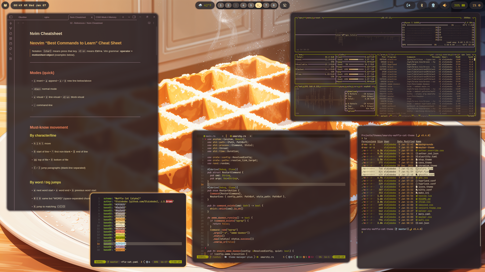

# Omarchy Waffle Cat Theme

Waffle Cat captures the comfort of a buttered waffle breakfast with a sunlit tabby purring on your lap. Its warm tones and understated accents create a soothing workspace without sacrificing clarity and contrast.

I created the Waffle-Cat colorscheme, which you can find here: https://github.com/OldJobobo/waffle-cat.

## Preview



## Install

Use the normal Omarchy theme install method:

```bash
omarchy theme install /path/to/omarchy-waffle-cat-theme
```

## Wallpapers

Grid preview of the `backgrounds` folder:

<table>
  <tr>
    <td></td>
    <td></td>
    <td></td>
  </tr>
  <tr>
    <td></td>
    <td></td>
    <td></td>
  </tr>
  <tr>
    <td></td>
    <td></td>
    <td></td>
  </tr>
  <tr>
    <td></td>
    <td></td>
    <td></td>
  </tr>
  <tr>
    <td></td>
    <td></td>
    <td></td>
  </tr>
  <tr>
    <td></td>
    <td></td>
    <td></td>
  </tr>
</table>
