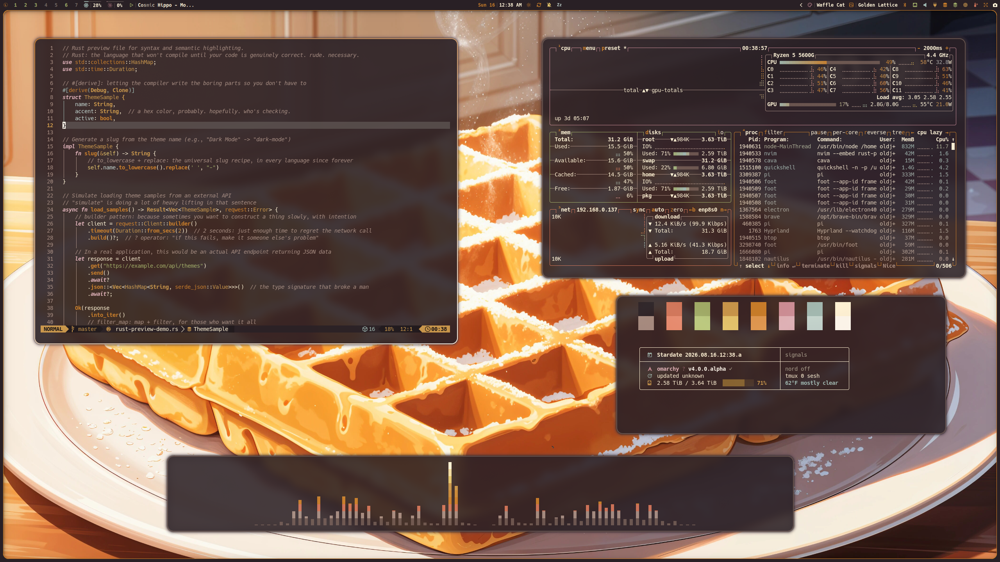
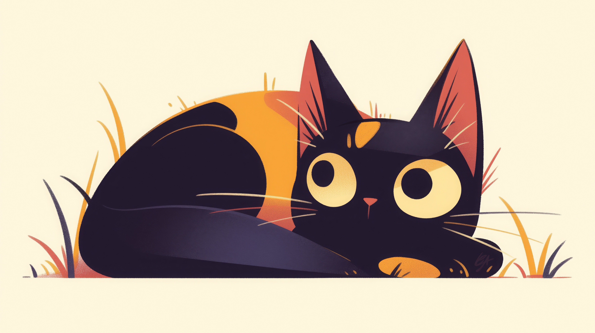
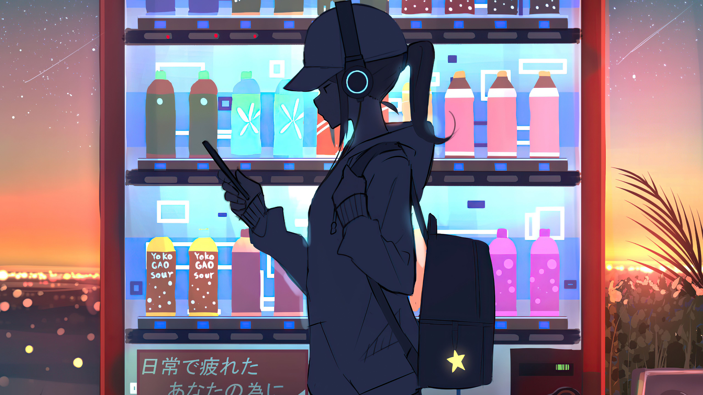
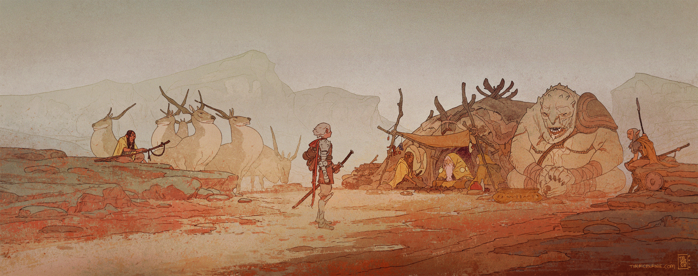
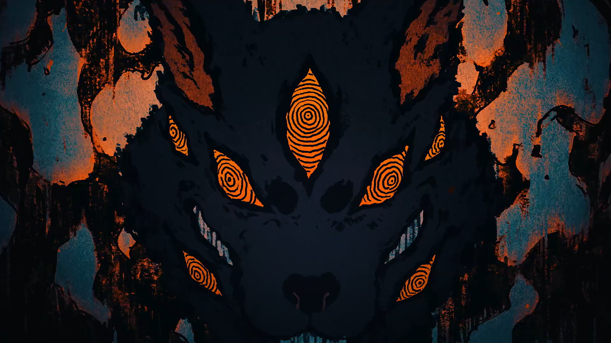

# Omarchy Waffle Cat Theme

Waffle Cat captures the comfort of a buttered waffle breakfast with a sunlit tabby purring on your lap. Warm amber tones and soft neutrals create a calm workspace without sacrificing clarity and contrast.

## Preview



## Install

Use the Omarchy theme installer:

```bash
omarchy-theme-install https://github.com/OldJobobo/omarchy-waffle-cat-theme
```

## What's included

- Hyprland rules and opacity tuning (`hyprland.conf`)
- Hyprlock styling (`hyprlock.conf`)
- Waybar colors (`waybar.css`) and layout (`waybar-theme`)
- Terminals: Alacritty (`alacritty.toml`), Kitty (`kitty.conf`), Ghostty (`ghostty.conf`)
- Shell/tools: Fish colors (`colors.fish`), fzf (`fzf.fish`)
- Apps/UI: GTK (`gtk.css`), Chromium (`chromium.theme`), Wofi (`wofi.css`)
- System tools: btop (`btop.theme`), cava (`cava_theme`), mako (`mako.ini`)
- Extras: Steam (`steam.css`), Vencord (`vencord.theme.css`), SwayOSD (`swayosd.css`), Walker (`walker.css`), Warp (`warp.yaml`), Zed (`zed.json`, `aether.zed.json`, `aether.override.css`), icons (`icons.theme`)

## Wallpapers

<table>
  <tr>
    <td></td>
    <td></td>
    <td></td>
  </tr>
  <tr>
    <td></td>
    <td></td>
    <td></td>
  </tr>
  <tr>
    <td></td>
    <td></td>
    <td></td>
  </tr>
  <tr>
    <td></td>
    <td></td>
    <td></td>
  </tr>
  <tr>
    <td></td>
    <td></td>
    <td></td>
  </tr>
  <tr>
    <td></td>
    <td></td>
    <td></td>
  </tr>
</table>

## Attribution

- Waffle Cat colorscheme: https://github.com/OldJobobo/waffle-cat
