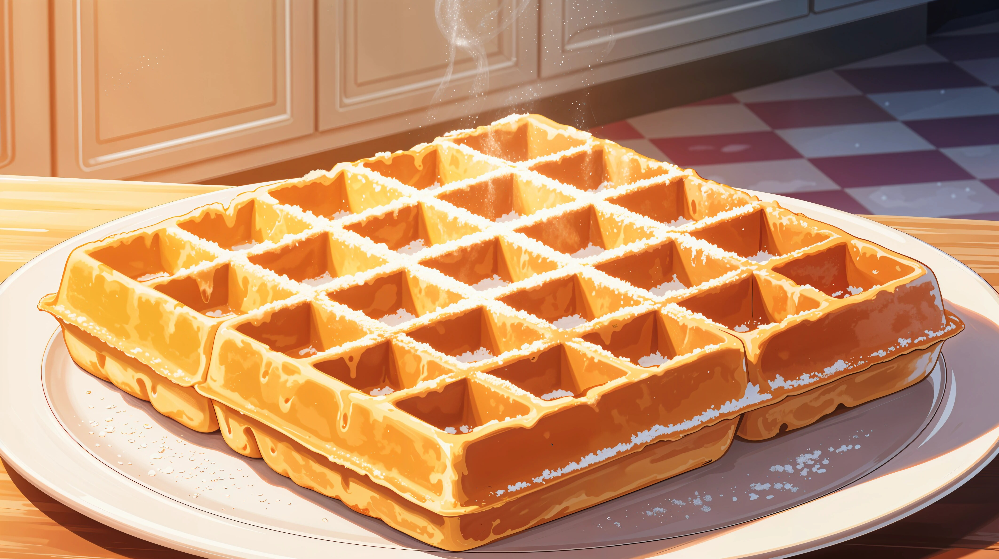
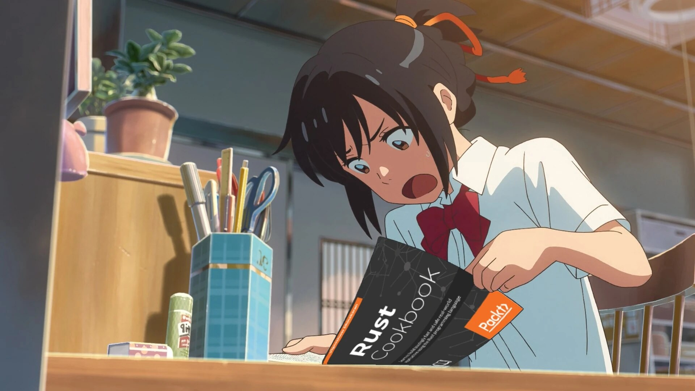
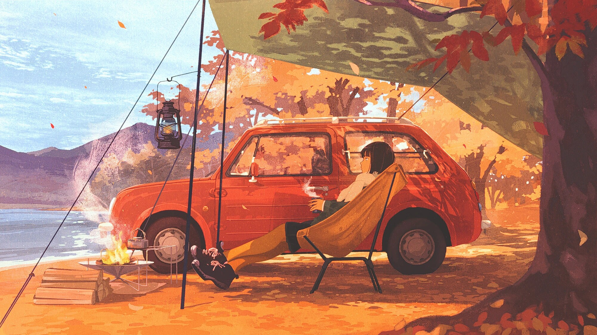
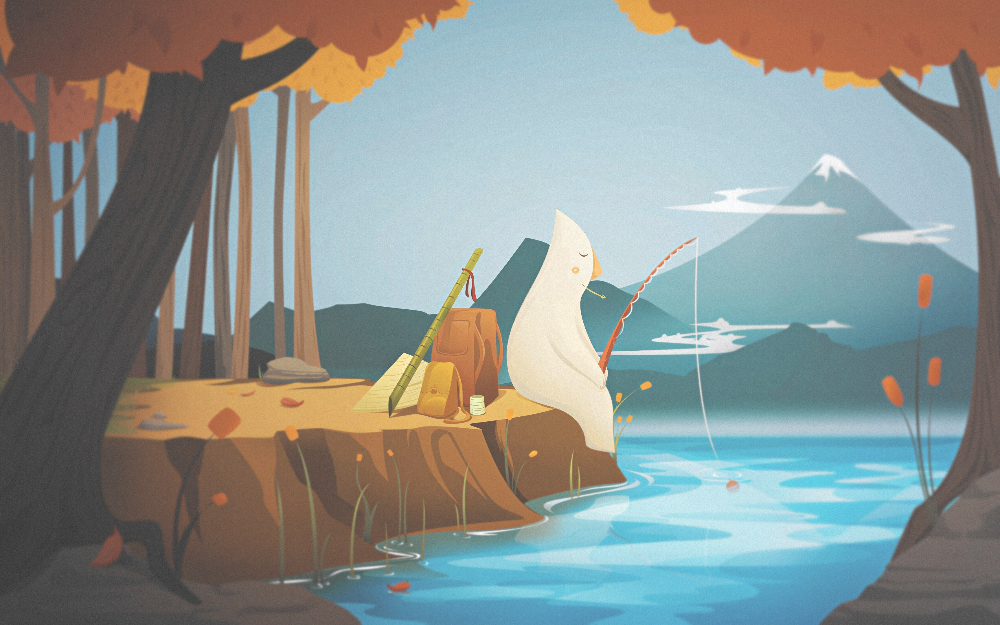

# Omarchy Waffle Cat Theme

Waffle Cat captures the comfort of a buttered waffle breakfast with a sunlit tabby purring on your lap. Warm amber tones and soft neutrals create a calm workspace without sacrificing clarity and contrast.

## Preview


## Install

Use the Omarchy theme installer:

```bash
omarchy-theme-install https://github.com/OldJobobo/omarchy-waffle-cat-theme
```

## What's included

- Native Omarchy 4 / Quattro palette and shell treatment (`colors.toml`, `shell.toml`)
- Quattro Hyprland borders, gaps, blur, shadows, and motion (`hyprland.lua`)
- Generated-app overrides for Alacritty, Foot, Ghostty, Kitty, btop, Chromium, Neovim, Helix, VS Code, Obsidian, Pi, Gum/tmux, keyboard lighting, and the screen-share picker
- Portable Base16 and Base24 palette exports in `palette/`
- Omarchy 3.8 compatibility styling for Hyprland, Hyprlock, Waybar, Walker, Mako, SwayOSD, and Wofi
- Optional integrations for Fish, fzf, cava, GTK/Aether, Steam, Vencord, Warp, and Zed

Quattro applies the native shell and generated-app files through the normal theme switch. The compatibility and optional integration files remain available for older Omarchy installations or manual app-specific setup.

## Wallpapers

<table>
  <tr>
    <td></td>
    <td></td>
    <td></td>
  </tr>
  <tr>
    <td></td>
    <td></td>
    <td></td>
  </tr>
</table>

## Attribution

- Waffle Cat colorscheme: https://github.com/OldJobobo/waffle-cat
- “Stillwater Spirit”: [Wallhaven #479j30](https://wallhaven.cc/w/479j30), uploaded by [Tsunan](https://wallhaven.cc/user/Tsunan); the original artist/source is not listed.
- “Morning Flow”: [Morning Coding Session — Chillstep Music to Help You Stay in Flow](https://www.youtube.com/watch?v=mcDCp3OprBU) on YouTube.
- Source attribution was not preserved for “Golden Lattice,” “Rust Panic,” “Lakeside Camp,” or “Winter Bokeh Cat.”
